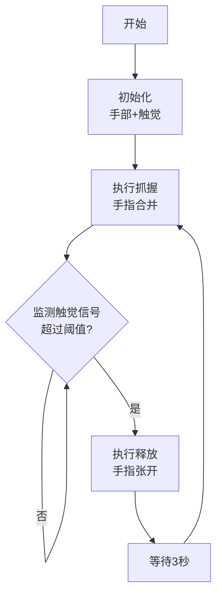
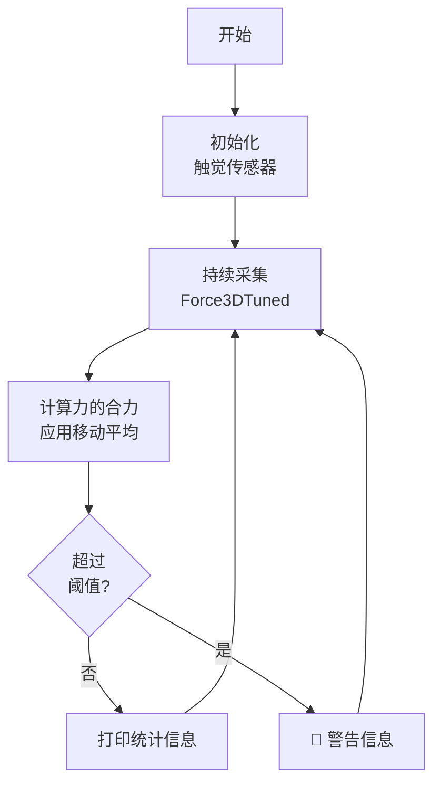

# 触觉仿生手集成演示 (Revo2 Tactile Grasp Demo)

## 📋 项目概述

这是一个包含**触觉传感器模块**和**Revo2 dexterous hand模块**的完整集成演示。该系统实现了一个能够根据触觉反馈自动调整的仿生手。

### 核心功能

1. **数据解码部分** 🔍
   - 同步采集触觉信号（使用Xense SDK）
   - 主要数据类型：`Sensor.OutputType.Force3DTuned`
   - 实时计算触觉力的合力模值

2. **算法计算-阈值判断** ⚖️
   - 监测触觉力是否超过设定阈值
   - 使用移动平均滤波器平滑噪声
   - 当超过阈值时标记为碰撞状态

3. **实时控制** 🤖
   - 手指先摆到抓握姿势（握住物体）
   - 进入实时监测循环
   - 物体受到扰动时，触觉模块识别超过阈值
   - 手自动放开，完成反射式释放

---

## 🚀 快速开始

### 前置条件

```bash
# 安装触觉模块SDK
pip install xensesdk

# 确保已安装项目依赖
pip install -r requirements.txt
```

### 基本运行

```bash
# 1. 自动检测设备并运行默认演示（抓握-释放循环）
python revo2_tactile_grasp_demo.py

# 2. 仅监测模式（用于验证触觉传感器）
python revo2_tactile_grasp_demo.py --mode monitor

# 3. 指定具体设备
python revo2_tactile_grasp_demo.py \
    --hand-port /dev/ttyUSB0 \
    --touch-serial BM000026

# 4. 自定义参数
python revo2_tactile_grasp_demo.py \
    --force-threshold 8.0 \
    --grasp-position 900 \
    --display-tactile
```

---

## ⚙️ 命令行参数

| 参数 | 类型 | 默认值 | 说明 |
|------|------|--------|------|
| `--hand-port` | str | None | 手的串口号（如 `/dev/ttyUSB0`），`None` 表示自动检测 |
| `--touch-serial` | str | None | 触觉传感器序列号（如 `BM000026`），`None` 表示自动检测 |
| `--force-threshold` | float | 5.0 | 触觉力阈值（单位：牛顿），超过该值判定为碰撞 |
| `--mode` | str | grasp_release | 运行模式：`grasp_release` 或 `monitor` |
| `--display-tactile` | flag | False | 是否显示触觉热力图窗口 |
| `--grasp-position` | int | 800 | 抓握位置（0-1000） |

---

## 🔧 配置说明

### 在代码中修改全局配置

打开 `revo2_tactile_grasp_demo.py`，编辑 `Config` 类：

```python
class Config:
    # 触觉传感器配置
    TACTILE_SERIAL_NUM = None              # 触觉传感器序列号
    TARGET_FPS = 30                        # 采集帧率
    DISPLAY_TACTILE = False                # 是否显示热力图
    
    # 力阈值配置
    FORCE_THRESHOLD = 5.0                  # 触觉力阈值（N）
    SMOOTHING_WINDOW = 3                   # 平滑窗口大小
    
    # 手部控制配置  
    GRASP_POSITION = 800                   # 抓握位置（0-1000）
    RELEASE_POSITION = 0                   # 释放位置（0-1000）
    CONTROL_DURATION = 500                 # 控制持续时间（ms）
    CONTROL_SPEED = 500                    # 控制速度
    
    # 监控配置
    PRINT_INTERVAL = 1.0                   # 打印间隔（秒）
```

---

## 📊 工作流程

### Grasp-Release 演示模式



### Monitor 监测模式



---

## 🔍 详细使用示例

### 示例 1：自动检测所有设备

```bash
python revo2_tactile_grasp_demo.py
```

**输出示例：**
```
============================================================
初始化手部控制...
============================================================
Device info: Revo2 Dexterous Hand, Serial: XXXX...

============================================================
初始化触觉采集...
============================================================
正在连接触觉传感器: None
触觉传感器初始化成功

============================================================
启动触觉抓握-释放演示
============================================================

[步骤1] 执行抓握...
✓ 力值: max=0.45N, mean=0.12N, 阈值=5.0N
...（监测中）
⚠️  检测到超过阈值的触觉力，执行释放...
✓ 释放完成

等待3秒后重新开始循环...
```

### 示例 2：调试阶段 - 仅监测

如果你还在调整阈值，可以先用监测模式查看触觉数据：

```bash
python revo2_tactile_grasp_demo.py --mode monitor --display-tactile
```

这样会：
- 持续采集触觉数据
- 实时显示触觉热力图（按 `q` 退出）
- 打印力值统计信息
- 不执行任何手部动作

### 示例 3：自定义阈值

根据你的物体和应用场景调整阈值：

```bash
# 敏感（容易触发释放）
python revo2_tactile_grasp_demo.py --force-threshold 2.0

# 迟钝（难以触发释放）
python revo2_tactile_grasp_demo.py --force-threshold 10.0
```

---

## 📈 理解触觉数据

### Force3DTuned 的含义

`Force3DTuned` 是一个 3D 力信息矩阵，每个像素点表示该位置的 3D 力向量 (Fx, Fy, Fz)。

```python
# 数据结构
force_3d_tuned: shape = (height, width, 3)
                # height 和 width 取决于传感器分辨率
                # 第3维度：[Fx, Fy, Fz] 三个方向的力
```

### 力的合力计算

```python
# 计算每像素的力的模长
force_norm = np.linalg.norm(force_3d_tuned, axis=2)  # shape = (height, width)

# 该帧的最大力值
max_force = np.max(force_norm)

# 该帧的平均力值  
mean_force = np.mean(force_norm)
```

### 移动平均平滑

为了减少噪声，系统使用滑动窗口平均：

```python
# 保持最近 N 帧的力值
force_history = [f1, f2, f3, ...]  # N=SMOOTHING_WINDOW

# 阈值判断使用平均值
smoothed_force = np.mean(force_history)
is_collision = smoothed_force > FORCE_THRESHOLD
```

---

## 🐛 调试与故障排除

### 问题 1：无法检测到触觉传感器

```bash
# 检查设备连接
ls /dev/ttyUSB*  # 查看有哪些串口

# 指定正确的序列号
python revo2_tactile_grasp_demo.py --touch-serial YOUR_SERIAL_NUMBER

# 先用监测模式验证
python revo2_tactile_grasp_demo.py --mode monitor
```

### 问题 2：触发灵敏度不合适

| 问题 | 原因 | 解决方案 |
|------|------|--------|
| 太容易释放 | 阈值太低 | 提高 `--force-threshold` 值 |
| 无法自动释放 | 阈值太高 | 降低 `--force-threshold` 值 |
| 数据波动大 | 噪声干扰 | 增加 `Config.SMOOTHING_WINDOW` |

### 问题 3：手指动作不响应

```bash
# 检查手的连接
python revo2_ctrl.py  # 运行简单的控制测试

# 查看详细日志
python revo2_tactile_grasp_demo.py  # 查看错误信息
```

---

## 📊 性能指标

- **触觉采样频率**：30 Hz（可配置）
- **控制响应延迟**：< 300 ms（含处理+阈值判断+通信）
- **平滑处理窗口**：3 帧（可配置）
- **力值范围**：0-100+ N（取决于传感器）

---

## 🔄 高级功能扩展

### 自定义碰撞检测算法

修改 `TactileDataCollector.is_collision_detected()` 方法：

```python
def is_collision_detected(self, current_data, threshold=None):
    # 示例：基于力变化率的碰撞检测
    if len(self.force_history) < 2:
        return False
    
    current_force = current_data['max_force']
    previous_force = self.force_history[-2]
    
    # 快速力变化表示碰撞
    force_change = abs(current_force - previous_force)
    return force_change > threshold * 0.5
```

### 多阶段控制

```python
async def grasp_release_control(self):
    """更复杂的控制策略"""
    # 轻轻抓握
    await self.hand.grasp(position=500, duration=300)
    
    # 逐渐加强
    await asyncio.sleep(1.0)
    await self.hand.grasp(position=800, duration=200)
    
    # 监测并释放
    await self.monitor_and_release(monitor_timeout=10.0)
```

---

## 📚 相关文档

- [Xense SDK 文档](https://xensesdk-cn.readthedocs.io/zh-cn/latest/XenseSDK/usr/API/selectSensorInfo.html)
- [Revo2 手控制 API](https://www.brainco-hz.com/docs/revolimb-hand/revo2/)
- [项目 README](../README.md)

---

## ⚠️ 安全注意事项

1. **测试时移开其他物体**，避免手指夹伤
2. **逐步调整阈值**，不要一次改动过大
3. **监测模式下不会移动手指**，可以安全地调试参数
4. **如果手指无法恢复**，按 Ctrl+C 中断程序（会自动释放）

---

## 📄 许可证

同项目主许可证

---

## 🤝 贡献与反馈

如有问题或建议，欢迎提交 Issue 或 Pull Request。

